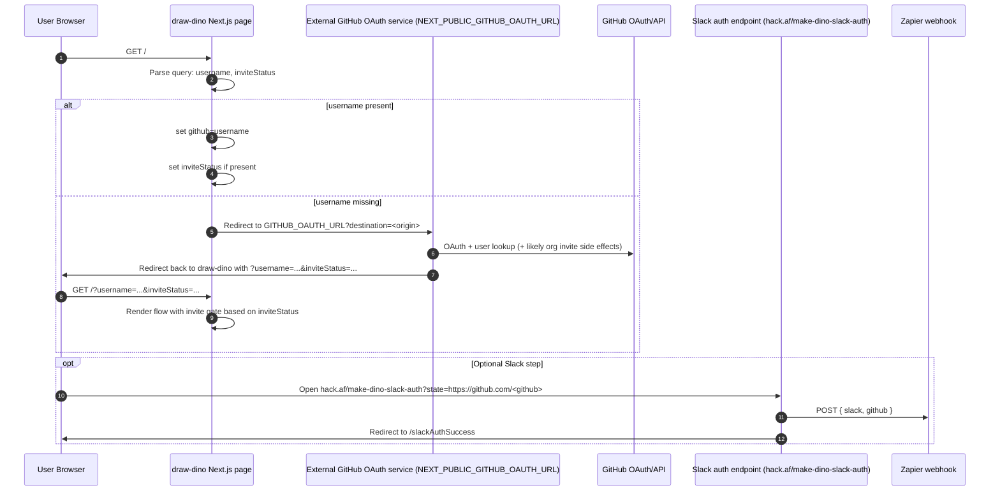
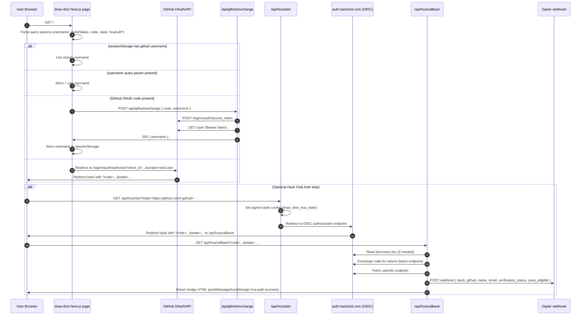

# Draw Dino Auth + Invite Flow Comparison

This document compares:

- Old flow at commit `65e023a5d16ede03a62120427267ee9ea20d3061`
- Current flow on branch `hca-auth` (HEAD)

It focuses on API routes hit, external calls, and where Zapier and org-invite behavior happen.

## 1) Old Flow (commit 65e023a)

### High-level summary

- The main app expected `username` (and optionally `inviteStatus`) in URL params.
- If `username` was missing, it redirected to `NEXT_PUBLIC_GITHUB_OAUTH_URL?destination=<origin>`.
- Invite behavior appears to have lived in that external GitHub OAuth service (outside this repo).
- Optional Slack auth used a separate flow (`hack.af/...`) that posted to Zapier.

### Sequence diagram

### In-repo route/call map (old)

1. `pages/index.js`
2. If no `username`, browser redirect to external `NEXT_PUBLIC_GITHUB_OAUTH_URL`.
3. Optional Slack auth entrypoint from UI:
   - `https://hack.af/make-dino-slack-auth?state=https://github.com/<github>`
4. In the deleted `draw-dino-auth/server.js` service:
   - `GET /update-github-url` (Passport Slack)
   - On success: `POST` to Zapier webhook `https://hooks.zapier.com/hooks/catch/507705/odyc4wo/`
   - Payload: `{ slack: <slack user id>, github: <state github URL> }`
   - Redirect to `/slackAuthSuccess`

### Where invites likely happened (old)

- `inviteStatus` came from the external GitHub OAuth redirect response.
- There is no GitHub org invitation API call in the old in-repo Next.js code.
- Therefore invite creation was likely handled by the external OAuth service behind `NEXT_PUBLIC_GITHUB_OAUTH_URL`.

## 2) Current Flow (hca-auth branch)

### High-level summary

- GitHub sign-in is now handled directly by this Next.js app (`/api/github/exchange`).
- Optional Hack Club Auth (HCA) is handled by new in-repo API routes (`/api/hca/start` and `/api/hca/callback`).
- Zapier is called in `hca/callback` (non-blocking unless `HCA_REQUIRE_WEBHOOK=1`).
- `inviteStatus` is still read from URL, but current GitHub exchange route does not produce it.

### Sequence diagram

### In-repo route/call map (current)

1. `pages/index.js`
2. If needed, browser redirect to GitHub authorize endpoint.
3. `POST /api/github/exchange`
   - Calls `https://github.com/login/oauth/access_token`
   - Calls `https://api.github.com/user`
   - Returns `{ username }`
4. Optional HCA sign-in from UI:
   - `GET /api/hca/start?state=https://github.com/<github>`
5. `GET /api/hca/callback?code=...&state=...`
   - Validates signed cookie/state
   - Calls OIDC discovery/token/userinfo endpoints
   - Calls Zapier webhook at `WEBHOOK_URL` (default `https://hooks.zapier.com/hooks/catch/507705/odyc4wo/`)
   - Returns success bridge HTML to notify opener tab

## 3) What changed materially between versions

1. GitHub auth ownership moved from an external service to in-repo `/api/github/exchange`.
2. Slack/HCA auth ownership moved into in-repo `/api/hca/start` and `/api/hca/callback`.
3. Zapier call payload expanded in current flow:
   - Old: mainly `{ slack, github }`
   - Current: `{ slack, github, name, email, verification_status, ysws_eligible }`
4. `inviteStatus` is still consumed by UI, but current in-repo GitHub exchange does not generate it.
5. No explicit GitHub org invitation API call exists in current in-repo routes.

## 4) Practical implication for invites

If org invites previously depended on the old external GitHub OAuth service, the current migration removed that invite side effect unless Zapier (or another external system) now recreates it based on the new webhook payload.